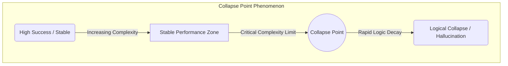
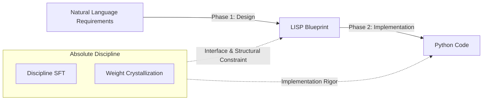

# Quantifying Design Intelligence: Breaking the Performance Ceiling of Small Language Models via Absolute Discipline

## Abstract
While Large Language Models (LLMs) have shown remarkable progress in code generation, their performance often collapses under complex structural constraints. Existing benchmarks primarily measure functional correctness but fail to quantify the precise point of logical failure. In this paper, we introduce the **LLM Complexity Benchmark**, a multi-dimensional framework designed to identify the **Collapse Point** of models based on structural and state-space complexity. Furthermore, we propose **Absolute Discipline**, a fine-tuning methodology and weight crystallization technique that enforces rigorous engineering protocols. Our results demonstrate that applying Absolute Discipline to a 3B-parameter model (Qwen 2.5-Coder) improves its success rate from 30.5% to 58.6%, rivaling the performance of 10B-class models. This suggests that the primary bottleneck in small-model reasoning is not parameter count, but a lack of architectural rigor, which can be mitigated through disciplined structural priors.

---

## 1. Introduction

The rapid advancement of LLMs has revolutionized automated programming. However, a significant gap remains between generating simple snippets and implementing complex systems that require dynamic state management and strict interface adherence. Smaller models (<7B parameters), in particular, often possess the requisite "knowledge" (syntax and semantics) but lack the "discipline" to execute that knowledge within a coherent architectural framework.

Current benchmarks such as HumanEval and MBPP are insufficient for evaluating these failures, as they focus on short, single-function tasks. Consequently, they overlook the "Logical Collapse"—where a model's reasoning breaks down due to nested control flows or high-entropy state transitions.

**Our Contributions:**
1.  **The Multi-dimensional Complexity Benchmark**: We propose a 5-axis metric to identify the "Collapse Point" where LLM reasoning fails due to structural load.
2.  **The Concept of Design Intelligence**: We define and quantify "Design Intelligence" as a structural reasoning capability independent of raw parameter count.
3.  **Absolute Discipline Methodology**: We introduce a two-stage process—Absolute Discipline SFT and Weight Crystallization—to embed engineering protocols into model weights.
4.  **Empirical Breakthrough**: We demonstrate that a 3B model can rival 10B-class models in complex algorithmic tasks by shifting focus from "scaling knowledge" to "crystallizing discipline."

---

## 2. Theoretical Framework: Design Intelligence

### 2.1 Defining Design Intelligence
We define **Design Intelligence** as the capability of an LLM to maintain structural and logical consistency throughout the execution of a specification. We model the overall performance ($P$) as a non-linear function of Knowledge ($K$) and Design Intelligence ($DI$):
\[ P = f(K, DI) \]
In small models, $DI$ is the dominant variable determining the success rate in high-complexity tasks. We quantify $DI$ using three measurable sub-metrics:
*   **Structure Preservation Rate**: The ratio of outputs that maintain the required class and method hierarchies.
*   **Interface Match Rate**: The precision of adherence to predefined signatures (names, types, and constraints).
*   **State Consistency Score**: The absence of self-contradictory logic in boundary conditions and index operations.

### 2.2 The Collapse Point
Auto-regressive models are prone to accumulating local optimization errors, leading to a **Collapse Point**—a critical complexity threshold where the global logic disintegrates. While techniques like Chain-of-Thought (CoT) provide local reasoning paths, they do not inherently prevent structural decay. Our approach uses "Discipline" as a structural regularizer to shrink the search space and delay the onset of the Collapse Point.

---

## 3. Experimental Design

### 3.1 Complexity Metrics
To pinpoint where models fail, we employ five metrics:
*   **Structural Complexity**: Depth of nesting and branch density.
*   **Recursion & Dependency**: Stack depth and DP-table interdependencies.
*   **State Space**: The volume of the search space and backtracking requirements.
*   **Contextual Complexity**: Specification length and noise in constraints.
*   **Semantic Nonlinearity**: The entropy of the intermediate logic (LISP) structure.

### 3.2 The Scaffolding Pipeline
We utilize a **NL → LISP → CODE** pipeline. The LISP representation serves as the "Architectural Blueprint," while Absolute Discipline ensures the model acts as a "Rigorous Engineer" capable of executing that blueprint without deviation.

---

## 4. Methodology: Absolute Discipline

### 4.1 Absolute Discipline SFT
We enforce two primary constraints during Supervised Fine-Tuning:
*   **Mandatory Encapsulation**: All solutions must be wrapped in a specific class structure (`Solution`).
*   **Strict Mapping**: Every identifier and type hint in the LISP blueprint must be mapped 1:1 to the Python implementation.
This reduces "output entropy" and forces the model to prioritize structural priors over probabilistic token generation.

### 4.2 Weight Crystallization
We merge the trained LoRA adapters into the base model using a 0.7 (Discipline) to 0.3 (Knowledge) linear ratio. This specific ratio was determined via pilot ablation studies to be the optimal inflection point; a higher discipline ratio (0.9) degraded language-specific syntax knowledge, while a lower ratio (0.5) failed to prevent structural collapse. This "Crystallization" process transforms the transient discipline of an adapter into a permanent behavioral trait of the model.

---

## 5. Results and Analysis

### 5.1 Performance Matrix
Our 3B "Disciplined" model achieved a 58.6% success rate, nearly matching the 10B Falcon 3 (59.3%).

| Model | Success Rate | Avg. Complexity | Note |
| :--- | :--- | :--- | :--- |
| **Qwen 2.5-Coder (14B)** | **76.3%** | 0.321 | SOTA in 10B+ class. |
| **Gemma 3 (12B)** | 74.6% | 0.335 | High structural consistency. |
| **Falcon 3 (10B)** | 59.3% | 0.280 | Mid-range baseline. |
| **Qwen 2.5-Coder (3B) [Final]** | **58.6%** | **0.301** | **Rivals 10B class (+92% gain).** |
| **Qwen 2.5-Coder (3B) [Base]** | 30.5% | 0.285 | Pre-discipline baseline. |

### 5.2 Pushing the Collapse Point
Data analysis shows that the base 3B model hits a Collapse Point at a complexity score of ~0.25. The Final (Disciplined) model maintains stability up to ~0.35, matching 10B models in this range. This confirms that Design Intelligence can compensate for lower parameter counts by providing a more resilient logical framework.

---

## 6. Discussion

### 6.1 Beyond Self-Correction
Previous research [7] indicates that LLMs cannot effectively "self-correct" deep structural errors. Our findings suggest that **Discipline Internalization** is superior to iterative correction; by preventing the error at the generation stage via structural constraints, we bypass the inherent limitations of reflective reasoning.

### 6.2 The Synergistic Effect
The 92% improvement in the 3B model is not solely due to the LISP scaffolding (which the base model also used), but the *internalization* of the discipline required to use that scaffold. This proves that architectural priors must be explicitly trained, not just prompted.

---

## 7. Conclusion
We have demonstrated that the "bottleneck" of small language models in code generation is primarily a structural discipline issue rather than a knowledge deficit. By quantifying Design Intelligence and applying Absolute Discipline, we successfully elevated a 3B model to 10B-class performance. This paradigm shift—from scaling parameters to crystallizing discipline—paves the way for more efficient, reliable, and architecturally sound AI systems.

All experimental resources, including datasets, benchmark tasks, and training/evaluation scripts, are publicly available at:
\url{https://github.com/aikenkyu001/llm_complexity_benchmark}

---

## References
[1] Qwen Team. (2024). Qwen2.5-Coder Technical Report. arXiv:2409.12186.  
[2] Google DeepMind. (2025). Gemma 3: Hybrid Modality and Scalable Intelligence. arXiv:2503.19786.  
[3] Chen, M., et al. (2021). Measuring Coding Challenge Competence With HumanEval. arXiv:2107.03374.  
[4] Austin, J., et al. (2021). Program Synthesis with Large Language Models. arXiv:2108.07732.  
[5] Hu, E. J., et al. (2021). LoRA: Low-Rank Adaptation of Large Language Models. arXiv:2106.09685.  
[6] Yadav, P., et al. (2024). Model Merging: A Survey. arXiv:2403.13257.  
[7] Huang, J., et al. (2023). Large Language Models Cannot Self-Correct. arXiv:2309.06275.  
[8] Gunasekar, S., et al. (2024). Phi-2: The Surprising Power of Small Language Models. arXiv:2402.14020.  
[9] Google Team. (2024). Gemma: Open Models Based on Gemini Research. arXiv:2403.08295.  
[10] Wei, J., et al. (2022). Chain-of-Thought Prompting Elicits Reasoning in Large Language Models. arXiv:2201.11903.
