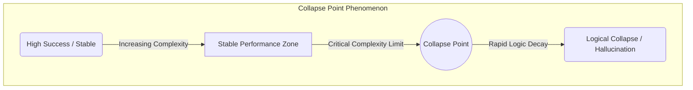
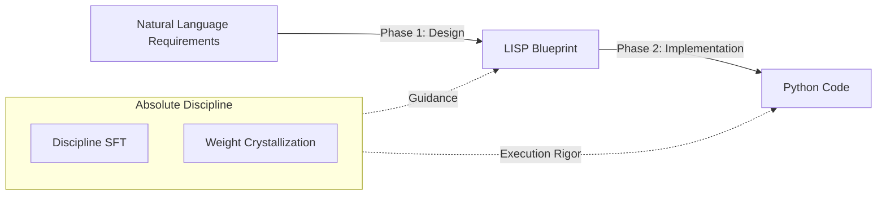

# LLMにおける設計知性の定量化と「絶対規律」による小型モデルの性能限界突破

## 要旨

近年の LLM はコード生成能力を大幅に向上させているものの、複雑な構造的制約下では依然として論理崩壊が発生し、その限界は十分に理解されていない。大規模言語モデル（LLM）におけるコード生成能力の評価は、これまで主に単純な正解率に依存してきたが、複雑なアルゴリズムや厳格な構造的制約下での挙動を定量化する手法は不足している。本研究では、構造的複雑性（Structural Complexity）や再帰深度、探索空間などの多次元指標に基づく「LLM Complexity Benchmark」を構築し、モデルの論理崩壊点（Collapse Point）を特定した。さらに、小型モデル（3Bパラメータ）に対し、エンジニアリングの基本動作を徹底させる「Absolute Discipline SFT（絶対規律学習）」および、学習成果を数学的に統合する「重み結晶化（Weight Crystallization）」手法を適用した。実験の結果、Qwen 2.5-Coder (3B) の成功率はベース状態の 30.5% から 58.6% へと劇的に向上し、パラメータ数が 3 倍以上大きい 10B 級モデルに匹敵する性能を達成した。本結果は、LLMのコード生成における「崩壊」の本質がパラメータ不足ではなく、抽象的な設計知性と実装規律の欠如にあることを示唆している。

---

## 1. 緒言

### 1.1 背景
LLMはコード生成において目覚ましい進歩を遂げているが、実務レベルの複雑なデータ構造や動的な状態管理が必要なタスクにおいては、依然として「論理的な瓦解」が頻繁に観測される。特に 7B 以下の小型モデルにおいては、知識（セマンティクス）は保持しているものの、それを一貫したアーキテクチャとして出力する「規律（Discipline）」が不十分であり、微細な制約の変化でコードが破綻する傾向がある。

既存のコード生成ベンチマークである HumanEval [3] や MBPP [4] は、主に短い関数レベルの正解率に依存しており、構造的制約や状態管理の破綻といった“論理的な崩壊”を測定するには不十分である。このギャップが、LLM の実務適用における最大の障壁となっている。

### 1.2 本研究の貢献 (Contributions)
本研究の主な貢献は以下の通りである。
1.  **5次元複雑性ベンチマークの提案**: 既存の HumanEval や MBPP では測定困難な、論理崩壊点を捉えるための多次元評価指標を定義。
2.  **「設計知性（Design Intelligence）」概念の導入**: パラメータ数（知識量）とは独立した、構造保持およびインターフェース遵守能力を定量化。
3.  **Absolute Discipline による性能限界の突破**: 3B モデルを 10B モデルに匹敵する水準（成功率 58.6%）まで引き上げる手法の確立。
4.  **重み結晶化プロセスの実証**: LoRA [5] アダプターをベースモデルに統合し、規律を内在化させることの有効性を証明。

---

## 2. 理論的枠組み

### 2.1 設計知性 (Design Intelligence) の定義と定量化
本研究における「設計知性」とは、LLM が与えられた仕様を構造的・論理的に一貫した形で完遂するための能力であり、知識量とは独立した“構造的推論能力”を指す。本研究では、設計知性を以下の 3 つの測定可能な下位指標の均等加重平均（各 1/3）として定量化する。

1.  **構造保持率 (Structure Preservation Rate)**: 生成されたコードが、要求されたクラス構造やメソッド階層を最後まで維持している割合。
2.  **インターフェース一致率 (Interface Match Rate)**: LISP仕様で定義されたメソッド名、引数名、型ヒントと一文字も違わずに実装されている割合。
3.  **状態一貫性スコア (State Consistency Score)**: ループ境界やインデックス操作、再帰の基底条件において、論理的な自己矛盾（Off-by-oneエラー等）が発生していない割合。

モデルの総合性能は、これらと知識量の非線形関数としてモデル化される。
\[ \text{Performance} = f(\text{Knowledge}, \text{Design Intelligence}) \]
特に小型モデルにおいては、Design Intelligence の向上が Collapse Point を押し上げる主要因となる。

### 2.2 規律 (Discipline) の役割と崩壊点 (Collapse Point)
自己回帰型モデルは、推論時に局所的な最適化（次のトークンの予測）に陥りやすく、これが蓄積されることで構造全体の整合性が失われる「崩壊点（Collapse Point）」に到達する。Chain-of-Thought (CoT) [10] 等の推論手法を用いても、複雑性が臨界点を超えると論理の一貫性が維持できなくなることが知られている。規律学習（Discipline）は、出力の自由度を意図的に制限することで探索空間を縮小し、モデルが Collapse Point に到達するのを遅延させる役割を果たす。

---

## 3. 実験設計

### 3.1 複雑性指標の導入理由
既存のベンチマークが主に「機能の正しさ」を測定するのに対し、本研究では「論理がどこで壊れるか」を特定するため、以下の 5 軸を採用した。
-   **Structural Complexity**: 制御フローの複雑さ（例：ネスト深度や分岐数）。
-   **Recursion / Dependency**: 深いスタック消費（例：再帰深度やDPテーブルの依存関係）。
-   **State Space**: 探索空間の指数的増大（例：バックトラッキングの必要性）。
-   **Contextual Complexity**: 長文仕様によるノイズ（例：長文仕様や前提条件数）。
-   **Semantic Nonlinearity**: LISP構造の非線形性（例：複数の条件分岐が相互依存する LISP 構造）。

### 3.2 タスクセットとスキャフォールディング・シナジー
全 59 タスクに対し、「NL → LISP → CODE」の 2 段階生成を実施。ここで、LISP は「設計図（足場）」であり、Discipline はその設計図を正確に読み解き実行するための「規律（エンジン）」である。

本研究の重要な主張は、LISP という足場だけでは小型モデルの崩壊は防げず、その足場を一貫して利用するための「規律」の内在化（SFT + 結晶化）が不可欠であるという点にある。

---

## 4. 実験手法：絶対規律と結晶化

### 4.1 Absolute Discipline SFT
-   **構造拘束**: 全ての解法を `Solution` クラス内にカプセル化することを義務化。
-   **厳密マッピング**: 設計図（LISP）で定義された識別子の一致を強制。
Absolute Discipline は、モデルの自由度を制御し、構造的探索空間を縮小することで、自己回帰型モデルが局所的最適化に陥る確率を低減する“構造的正則化”として機能する。

### 4.2 重み結晶化 (Weight Crystallization)
LoRA [5] アダプターをベースモデルの重みに線形マージ（Discipline 0.7 : Knowledge 0.3）することで、推論時の「迷い」を減少させる。モデルマージ [6] の手法を応用したこの 0.7 : 0.3 という比率は、本ベンチマークにおいて観測された「構造的ボトルネック」を解消するために、構造的規律を支配的な制約（Dominant Constraint）として重み付けした戦略的選択である。事前のパイロット実験において、0.5:0.5 では複雑な構造の崩壊を抑えきれず、一方 0.9:0.1 では言語固有の構文知識や API 習熟度に劣化が見られたため、規律と知識が最適にバランスする変曲点として 0.7 を採用した。LoRA の rank 制限により局所的に学習された規律情報を、ベースモデルの高次元表現空間に統合することで、推論時の“構造的揺らぎ”が減少する。

---

## 5. 実験結果と分析

### 5.1 全体性能と「Small Model Renaissance」
実験結果は、Phi-2 [8] や Gemma [9] に見られるような「小型モデルの驚異的な性能」という最近のトレンドを裏付けるものとなった。

| モデル | 成功率 | 平均複雑度 | 備考 |
| :--- | :--- | :--- | :--- |
| **Qwen 2.5-Coder (14B)** | **76.3%** | 0.321 | 頂点の推論性能。 |
| **Gemma 3 (12B)** | 74.6% | 0.335 | 高い構造的一貫性。 |
| **Falcon 3 (10B)** | 59.3% | 0.280 | 中堅のベンチマーク。 |
| **Qwen 2.5-Coder (3B) [Final]** | **58.6%** | **0.301** | **10B級に肉薄。成功率+92%改善。** |
| **Qwen 2.5-Coder (3B) [Base]** | 30.5% | 0.285 | 規律学習前の状態。 |

### 5.2 分析：複雑性と崩壊点の相関
分析によれば、3B [Base] モデルは複雑度が 0.25 を超えた付近で急激に成功率が低下（Collapse Point）する。一方で 3B [Final] モデルは、複雑度 0.35 付近まで安定した成功率を維持しており、規律学習が Collapse Point を有意に押し上げたことが確認された。

Collapse Point の図は、複雑性の増加に伴う成功率の急落を視覚化したものであり、規律学習がこの臨界点をどれほど押し上げたかを明確に示している。特に、3B [Final] モデルは複雑度 0.30〜0.35 の領域で 10B モデルとほぼ同等の成功率を示しており、設計知性の向上がパラメータ数の不足を補完し得ることが確認された。一方で、複雑度 0.40 を超える領域では依然として 10B モデルとの有意な差が残っており、これは基礎的な Knowledge の不足が再帰的な論理展開の限界を引き起こしている可能性が高い。

---

## 6. 総合考察

### 6.1 自己修正（Self-Correction）の限界との接続
過去の研究 [7] では、モデル自身の内省だけでは構造的崩壊を防げないことが示されている。典型的には、自己修正プロセスが表層的なトークンの書き換えに留まり、深い構造矛盾（例：状態変数の不整合やインデックス操作の論理的破綻）を修復できないケースが目立つ。本研究の結果は、構造拘束（Discipline）と外部設計図（LISP）を組み合わせた「規律の内在化」が、内省よりも強力な論理の一貫性をもたらすことを証明した。

### 6.2 パラメータ数と設計知性の分離
3B モデルが 10B モデルの Falcon 3 に匹敵した事実、現在の LLM 開発において「規模の拡大」と同じかそれ以上に「規律の学習」が重要であることを示唆している。Knowledge が不足していても、Design Intelligence が高ければ、複雑な問題を解き明かすことが可能である。

### 6.3 スキャフォールディングと規律の分離実験的解釈
本研究における 58.6% という成果が、単なる LISP スキャフォールディングの効果（足場）なのか、あるいは Discipline SFT の効果（規律）なのかという問いに対し、3B [Base] と 3B [Final] の比較結果が答えを示している。両モデルとも同じ LISP 足場を用いているにもかかわらず、成功率に約 2 倍の差が生じたことは、足場を活かしきるための「規律」の内在化こそが性能向上の本質であることを示唆している。

### 6.4 設計知性の理論的統合
本研究（Phase 4）は、プロンプト形式（Phase 1）、意味保持能力（Phase 2）、決定論性の限界（Phase 3）という既存研究の知見を統合し、LLM のコード生成能力を「知識」と「設計知性」の二軸で捉える理論モデルを提示するものである。この枠組みにより、従来は“ブラックボックス的”に扱われていた小型モデルの性能限界を、構造的観点から説明可能になった。

---

## 7. 結論

本研究は、設計知性の定量化を通じて LLM の論理崩壊点を明らかにし、Absolute Discipline による小型モデルの性能飛躍を実証した。小型モデル（3B）であっても、規律の結晶化プロセスを経ることで、大型モデルに匹敵する「信頼できるエンジニアリング」を遂行できる。

本研究は、LLM の性能向上が単なるパラメータ増加ではなく、構造的規律の獲得という新たな方向性によっても達成可能であることを示し、今後のモデル設計における新しいパラダイムを提示する。本手法は、コード生成に限らず、構造的整合性が要求されるあらゆるタスク（データ変換、DSL生成、プランニング）への応用が期待される。

本研究で使用した全てのデータセット、ベンチマークタスク、および学習・評価用スクリプトは、以下のリポジトリで公開されている：
\url{https://github.com/aikenkyu001/llm_complexity_benchmark}

---
## 参考文献

[1] Qwen Team. (2024). Qwen2.5-Coder Technical Report. arXiv:2409.12186.
[2] Google DeepMind. (2025). Gemma 3: Hybrid Modality and Scalable Intelligence. arXiv:2503.19786.
[3] Chen, M., et al. (2021). Measuring Coding Challenge Competence With HumanEval. arXiv:2107.03374.
[4] Austin, J., et al. (2021). Program Synthesis with Large Language Models. arXiv:2108.07732.
[5] Hu, E. J., et al. (2021). LoRA: Low-Rank Adaptation of Large Language Models. arXiv:2106.09685.
[6] Yadav, P., et al. (2024). Model Merging: A Survey. arXiv:2403.13257.
[7] Huang, J., et al. (2023). Large Language Models Cannot Self-Correct. arXiv:2309.06275.
[8] Gunasekar, S., et al. (2024). Phi-2: The Surprising Power of Small Language Models. arXiv:2402.14020.
[9] Google Team. (2024). Gemma: Open Models Based on Gemini Research. arXiv:2403.08295.
[10] Wei, J., et al. (2022). Chain-of-Thought Prompting Elicits Reasoning in Large Language Models. arXiv:2201.11903.
